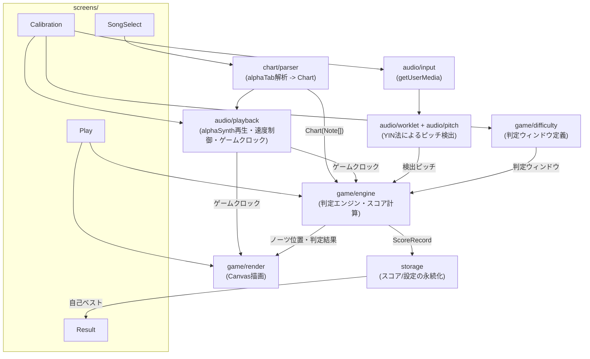
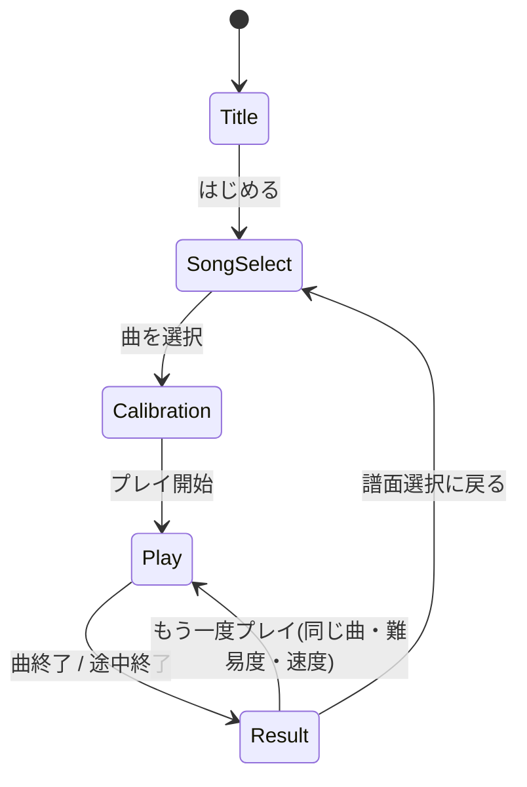

# FRETRUSH 構想設計書 (v1 ドラフト)

本書は [spec.md](spec.md)(外部仕様書)で定義した機能・振る舞いを、どう実現するかをまとめた
内部設計ドキュメントである。**spec.mdの内容と矛盾する設計は行わない。** 各章の冒頭に、
対応する spec.md の節番号を明記する。spec.mdの数値(誤差閾値・スコア計算式など)を変更する
必要が生じた場合は、先に spec.md 側を更新してから本書に反映する。

## 1. 技術スタック

*(対応: spec.md 2章 動作環境)*

| 領域 | 採用技術 | 理由 |
|---|---|---|
| 言語 | TypeScript | 型でノーツ/判定データの整合性を担保しやすい |
| ビルド | Vite | セットアップが軽量、開発サーバーの起動が速い |
| UI(画面遷移まわり) | React | タイトル/選択/キャリブレーション/リザルトなど、状態を持つ通常のUI画面に向く |
| プレイ画面の描画 | Canvas 2D(Reactの外) | 60fpsでノーツを動かし続けるため、VDOM差分計算を経由しない直接描画にする |
| TAB譜パース | [alphaTab](https://alphatab.net/)(`@coderline/alphatab`) | spec.md 5章の通り、Guitar Pro形式を独自パーサーなしで読み込む |
| BGM再生 | alphaTab付属の `alphaSynth` | spec.md 5〜6章の通り、別途音源ファイルを持たずGuitar Pro内の演奏情報をそのまま合成音として再生できる。再生速度(テンポ)を変えてもピッチが変わらない |
| 音声入力・解析 | Web Audio API + AudioWorklet | メインスレッド(UI/描画)をブロックせずにピッチ検出を回す |
| 永続化 | localStorage | サーバーなしの前提(spec.md 2章)。v1で扱うデータ量は小さく十分間に合う |
| パッケージ管理 | npm | 特段の理由がない限りデファクトを採用 |

サーバーは一切持たない。ビルド成果物は静的ファイル一式となり、ブラウザで直接開くか
任意の静的ホスティングに置くだけで動作する(spec.md 2章「サーバー不要」)。

## 2. ディレクトリ構成(案)

```
src/
  app/                 画面遷移(状態マシン)とルートコンポーネント
  screens/
    Title/
    SongSelect/
    Calibration/
    Play/              Canvas描画はこの配下に閉じ込める
    Result/
  game/
    engine/            判定エンジン、スコア計算
    render/            レーン・ノーツのCanvas描画
    difficulty/        難易度プリセット定義、詳細設定のバリデーション(判定エンジンが参照するルール)
  audio/
    input/             getUserMedia まわりのラッパー(マイク入力)
    worklet/           AudioWorkletProcessor(ピッチ検出をオーディオスレッドで実行)
    pitch/             YIN法の実装(worklet からも単体テストからも呼べる形にする)
    playback/          alphaSynth によるBGM再生・再生速度制御、ゲームクロックの提供(音声出力)
  chart/
    parser/            alphaTab の解析結果 -> 内部 Chart 型への変換
  storage/             localStorage 経由のスコア/設定の読み書き
  types/               画面を横断する共有型定義
```

「TAB譜パース」「音声解析」「判定エンジン」「描画」「永続化」を別モジュールに分離し、
それぞれ単体でテストできる形にする(判定エンジンは音声もCanvasも知らなくてよい設計にする)。

### 2.1 モジュール依存関係図

矢印は「利用する」方向。`game/engine`(判定エンジン)は `audio` や `game/render` を直接知らず、
プレーンなデータ(検出ピッチ・ゲームクロック・Chart)だけを受け取る形に閉じている。



## 3. データモデル

*(対応: spec.md 5章 TAB譜データ仕様 / 6章 BGM再生・再生速度仕様 / 8章 判定仕様 / 9章 スコア計算仕様 / 10章 スコア保存仕様)*

```ts
// chart/types.ts
type StringNumber = 1 | 2 | 3 | 4 | 5 | 6; // TAB譜の弦番号(1弦〜6弦)

interface Note {
  id: string;
  timeMs: number;        // 曲頭からの発音タイミング(判定ラインに到達する時刻)
  string: StringNumber;
  fret: number;           // 0 = 開放弦
  durationMs?: number;    // v1では表示用途のみ。判定は始点(timeMs)のみで行う(spec.md 5章)
}

interface Chart {
  songId: string;
  title: string;
  artist: string;
  bpm: number;
  tuning: 'standard-eadgbe'; // v1は固定(spec.md 2章)
  notes: Note[];
  sourceFormat: 'gp3' | 'gp4' | 'gp5' | 'gpx' | 'gp' | 'musicxml' | 'alphatex';
}

// game/difficulty/types.ts
type DifficultyPresetId = 'very-loose' | 'loose' | 'standard' | 'strict' | 'very-strict' | 'custom';

interface JudgementWindow {
  timingPerfectMs: number;
  timingGoodMs: number;
  pitchPerfectCents: number;
  pitchGoodCents: number;
}

interface DifficultyPreset {
  id: DifficultyPresetId;
  label: string; // 例: 「標準」
  window: JudgementWindow;
}

// game/engine/types.ts
type JudgementRank = 'perfect' | 'good' | 'miss';

interface JudgementResult {
  noteId: string;
  rank: JudgementRank;
  timingErrorMs: number;
  pitchErrorCents: number | null; // 無音などでピッチ未検出の場合は null
}

// audio/playback/types.ts
type PlaybackSpeedPercent = number; // 50-100 の整数(50%〜100%、5%刻みに丸めて記録する。spec.md 6章/10章)

// storage/types.ts
interface ScoreRecord {
  songId: string;
  difficultyId: DifficultyPresetId;
  speed: PlaybackSpeedPercent; // 例: 100 = 等倍速
  bestScore: number;
  rank: string; // 'S' | 'A' | 'B' | 'C' | ...
  maxCombo: number;
  accuracy: number; // 0-1
  breakdown: { perfect: number; good: number; miss: number };
  recordedAt: string; // ISO 8601
}
```

spec.md 5章の通り、TAB譜データそのものの独自フォーマットは持たない。`Chart` はあくまで
alphaTabの解析結果を判定エンジンが扱いやすい形に写した**内部表現**であり、保存・配布用の
フォーマットではない(元のGuitar Proファイルはそのまま保持し、必要な情報だけ都度抽出する)。

## 4. TAB譜取り込みパイプライン

*(対応: spec.md 5章)*

1. ユーザーが `.gp3`〜`.gp5` / `.gpx` / `.gp` ファイルを選択(譜面選択画面)
2. `alphaTab` の `ScoreLoader` でファイルをパースし `Score` オブジェクトを得る
3. `Score` から、チューニングが標準EADGBE以外のトラックは警告を出しつつ除外(spec.md 2章「v1は
   レギュラーチューニング固定」)。トラックが複数ある場合は最初のギタートラックを採用する
4. トラック内の各 `Beat`/`Note` を走査し、`{ timeMs, string, fret }` の `Note[]` に変換する
   - `alphaTab` の内部ティック値を `Score.tempo` (BPM) を使って実時間(ms)に変換する
   - 同一タイミングに複数弦の音が同時に存在する(=和音)場合、v1では**最も高音側の1音のみ**を
     採用し単音譜面として扱う(spec.md 1章「v1スコープ: 単音メロディの判定のみ」との整合)
5. 変換結果を `Chart` としてメモリ上に保持し、`localStorage` にはファイルそのもの(または
   Base64化した元データ)をキャッシュして次回起動時に再インポート不要にする

## 5. BGM再生・再生速度制御

*(対応: spec.md 6章 BGM再生・再生速度仕様)*

- TAB譜取り込み時(4章)に得た `alphaTab` の `Score` オブジェクトを、そのまま `alphaSynth` に
  渡して再生する。曲ごとの音声ファイルは持たない(spec.md 5〜6章)
- 再生速度はキャリブレーション画面(spec.md 4.3節)で選んだ 50%〜100% の値を `alphaSynth` の
  再生速度パラメータに適用する。alphaSynthはテンポ(BPM相当)をスケールして再生するため、
  ピッチは変化しない(spec.md 6章)
- **ゲームクロックは `alphaSynth` の再生位置を基準にする。** BGM再生を導入する以上、判定エンジン
  (7章)・描画(9章)ともにこの時刻を単一の真実源として参照し、ズレが生じないようにする
  (v1では独自のタイマーとBGM再生位置を別々に進行させない)
- ノーツの `timeMs`(4章の`Chart`)はBGMと同じ `Score` から生成しているため、速度を変えても
  BGMとノーツの相対タイミングは自動的に一致する。速度倍率をノーツ側に別途掛け合わせる処理は
  不要(alphaSynthの再生位置がそのまま「スケール後の経過時間」になるため)
- 曲の再生中に速度を変更する操作はv1では提供しない(spec.md 6章「プレイ中の曲を通して固定」)。
  速度は曲を開始する前(キャリブレーション画面)でのみ変更できる

## 6. 音声解析パイプライン

*(対応: spec.md 7章 音声解析仕様)*

```
getUserMedia(audio)
  -> MediaStreamAudioSourceNode
  -> AudioWorkletNode("pitch-detector")   … オーディオスレッドで実行
       - 一定サイズのフレーム(例: 2048サンプル)ごとにYIN法で基本周波数を推定
       - 検出結果 { timeSec, frequencyHz | null, confidence } を
         port.postMessage でメインスレッドへ送信
  -> メインスレッド側のリングバッファに直近数百msぶん蓄積
```

- YIN法を選んだ理由は spec.md 7章の通り。実装は `audio/pitch/yin.ts` に純粋関数として置き、
  AudioWorkletProcessor からも、ブラウザなしの単体テストからも同じ実装を呼べるようにする
- フレームサイズは低音弦(6弦開放 E2 ≈ 82.4Hz、周期約12ms)を数周期分カバーできる大きさが
  必要になるため、まず2048サンプル(44.1kHzで約46ms)を初期値とし、実測しながら調整する
- 検出周波数は「フレット位置 -> 期待周波数」の対応と比較するため、セント差に変換する:
  `cents = 1200 * log2(detectedHz / expectedHz)`
  `expectedHz` はレギュラーチューニングの開放弦周波数(E2/A2/D3/G3/B3/E4)を
  `expectedHz = openHz * 2^(fret/12)` で半音ずつ上げて求める(v1はチューニング固定なので
  固定テーブルで済む。spec.md 2章)
- v1は単音検出のみを対象とするため、YINの結果として最も確からしい基本周波数を1つだけ採用する
  (複数ピークの分離は行わない。spec.md 7章)

## 7. 判定エンジン

*(対応: spec.md 8章 判定仕様、8.1節の許容誤差テーブル)*

- ゲームクロックは5章の通り `alphaSynth` の再生位置を基準にする(BGM・ノーツ・判定を単一の
  時刻源で同期させるため)
- 各ノーツは `timeMs`(判定ラインに到達する予定時刻)を持つ。現在時刻との差分から画面上の
  x座標を計算し描画する(8章の通り、判定ラインは画面右側の固定位置)
- 判定はノーツごとに、判定ウィンドウ(選択中の `DifficultyPreset.window`)に基づき以下の順で行う
  1. ノーツの `timeMs` を基準に、直近の検出ピッチ列から最も近いサンプルを取り出す
  2. タイミング誤差 `timingErrorMs` とピッチ誤差 `pitchErrorCents` をそれぞれ算出
  3. spec.md 8.1節の通り、タイミング判定とピッチ判定のうち**厳しい方**を採用してランクを決定
  4. どのプリセットのGood範囲にも収まらない場合、またはノーツ通過時に検出ピッチが
     得られなかった場合は `miss`
- 再生速度(5章)を落としても、判定ウィンドウの数値(ms/セント)自体はそのまま使う。ゲームクロックの
  進み方自体がスローになっているため、閾値側を速度で補正する必要はない(spec.md 6章・8章)
- キャリブレーションで得たオフセット値(spec.md 4.3節)は、判定ライン到達時刻の計算 or
  検出ピッチのタイムスタンプ側で一律補正する(どちら側で補正するかは実装時に決定するが、
  「判定される瞬間」のズレとしてユーザーには一貫して見えるようにする)
- 判定結果 `JudgementResult` は都度スコア計算エンジン(8章)に渡す

## 8. スコア計算

*(対応: spec.md 9章 スコア計算仕様)*

spec.md 9章の式をそのまま実装する。

```ts
function baseScorePerNote(totalNotes: number): number {
  return 1_000_000 / totalNotes;
}

function comboMultiplier(consecutivePerfect: number): number {
  return 1 + Math.min(consecutivePerfect / 100, 0.5);
}

function judgementCoefficient(rank: JudgementRank): number {
  return rank === 'perfect' ? 1.0 : rank === 'good' ? 0.5 : 0;
}
```

- `consecutivePerfect` は Perfect が連続した回数。Good/Miss を挟んだ時点で0にリセットする
  (spec.md 9章「コンボ倍率」の定義通り)
- 合計は四捨五入して `bestScore` と比較する
- ランク(S/A/B/C…)の閾値は spec.md 9章の通り未確定のため、`game/difficulty/rankTable.ts` に
  設定値としてまとめ、後から調整しやすくする

## 9. 描画(プレイ画面)

*(対応: spec.md 4.4節)*

- Canvas 2D で1本の描画ループ(`requestAnimationFrame`)を回す
- レーンは固定(1弦を最上段、6弦を最下段とする6本の水平線、太さは弦番号に応じて変える)
- ノーツのx座標は `ゲーム内時刻` と `note.timeMs` の差分から線形補間で求め、画面左から
  判定ライン(画面右固定位置)に向けて移動させる(4.4節の通り)
- 判定ラインのすぐ右に弦名ラベル(EADGBE)を固定表示する(4.4節)
- 直近の判定結果(Perfect/Good/Miss)は判定ライン付近にポップアップ表示し、一定時間で
  フェードアウトさせる

## 10. 永続化

*(対応: spec.md 10章 スコア保存仕様、11章 非機能要件)*

- `localStorage` に以下のキーで保存する(v1、サーバー同期なし)
  - `fretrush:scores` … `ScoreRecord[]`(曲ID×難易度ID×再生速度ごとに1件、更新時は上書き)
  - `fretrush:settings` … キャリブレーションのオフセット値、直近選択した判定プリセット・再生速度等
  - `fretrush:charts` … インポート済み譜面のメタデータ一覧(実ファイルはIndexedDB化を
    将来検討。v1はサイズの小さい譜面を主対象とするためlocalStorageで許容する)
- 記録単位は spec.md 10章の通り「曲 × 判定の厳しさ × 再生速度」。詳細設定でプリセットから
  外れた場合の扱い、および再生速度をどの粒度(例: 5%刻み)で記録するかは、10章に明記の通り
  実装時に決定する。`PlaybackSpeedPercent`(3章)は5%刻みの整数に丸めてキーとする想定

## 11. 画面遷移の実装

*(対応: spec.md 4章 画面構成)*

React側に単純な状態マシン(`type Screen = 'title' | 'songSelect' | 'calibration' | 'play' | 'result'`)
を持ち、4章の遷移図通りに画面を切り替える。プレイ画面に入る際にCanvas描画ループを開始し、
リザルト画面に遷移すると同時に停止・破棄する(常時Canvasを回さない)。

### 11.1 状態遷移図



- `Play` に入る条件は必ず `Calibration` を経由すること(判定プリセット・再生速度は
  キャリブレーション画面で確定させてからプレイ画面に渡す。spec.md 4.3節)
- `Result` から `Play` へ直接戻る「もう一度プレイ」は、直前と同じ曲・難易度・速度設定を
  引き継ぐ(キャリブレーション画面を再度経由しない)

## 12. v1で作らないもの

*(対応: spec.md 12章 v1スコープ外)*

以下は本設計書でも意図的に設計を作り込まない。将来必要になった時点で章を追加する。

- 和音判定用のポリフォニック音高推定(spec.md 12章)
- mp3等からのTAB譜自動生成(spec.md 12章)
- 変則チューニング対応(spec.md 12章)
- サーバー同期・オンラインランキング(spec.md 12章)
- 等倍速より速い再生速度、プレイ中の動的な速度変更(spec.md 6章・12章)
