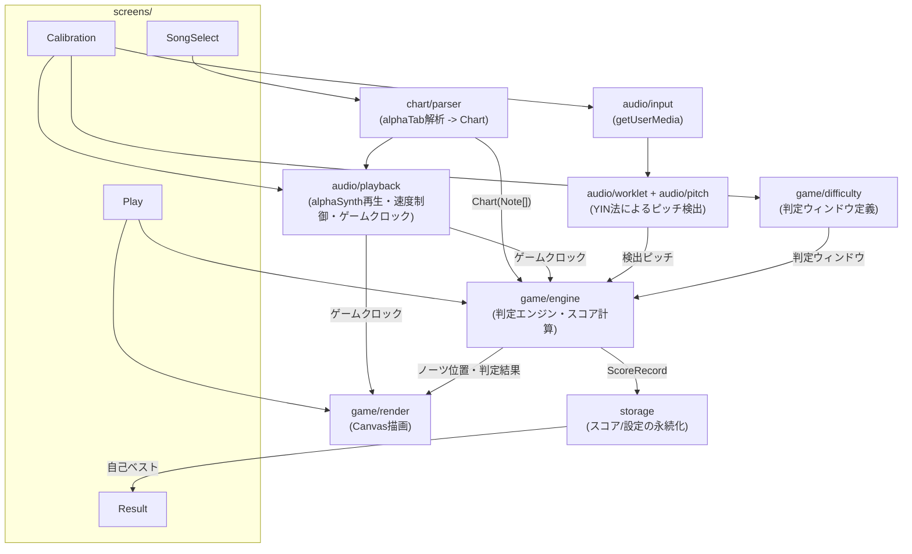
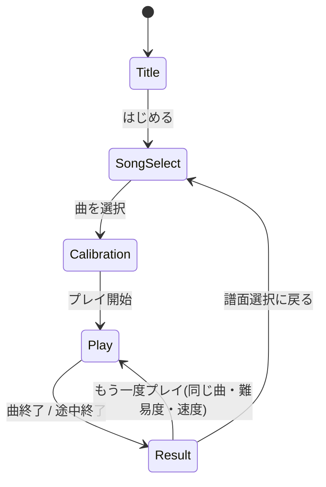

# FRETRUSH 構想設計書 (v1 ドラフト)

本書は [spec.md](spec.md)(外部仕様書)で定義した機能・振る舞いを、どう実現するかをまとめた
内部設計ドキュメントである。**spec.mdの内容と矛盾する設計は行わない。** 各章の冒頭に、
対応する spec.md の節番号を明記する。spec.mdの数値(誤差閾値・スコア計算式など)を変更する
必要が生じた場合は、先に spec.md 側を更新してから本書に反映する。

## 1. 技術スタック

*(対応: spec.md 2章 動作環境)*

| 領域 | 採用技術 | 理由 |
|---|---|---|
| 言語 | TypeScript | 型でノーツ/判定データの整合性を担保しやすい |
| ビルド | Vite | セットアップが軽量、開発サーバーの起動が速い |
| UI(画面遷移まわり) | React | タイトル/選択/キャリブレーション/リザルトなど、状態を持つ通常のUI画面に向く |
| プレイ画面の描画 | Canvas 2D(Reactの外) | 60fpsでノーツを動かし続けるため、VDOM差分計算を経由しない直接描画にする |
| TAB譜パース | [alphaTab](https://alphatab.net/)(`@coderline/alphatab`) | spec.md 5章の通り、Guitar Pro形式を独自パーサーなしで読み込む |
| BGM再生 | alphaTab付属の `alphaSynth` | spec.md 5〜6章の通り、別途音源ファイルを持たずGuitar Pro内の演奏情報をそのまま合成音として再生できる。再生速度(テンポ)を変えてもピッチが変わらない |
| 音声入力・解析 | Web Audio API + AudioWorklet | メインスレッド(UI/描画)をブロックせずにピッチ検出を回す |
| 永続化 | localStorage | サーバーなしの前提(spec.md 2章)。v1で扱うデータ量は小さく十分間に合う |
| パッケージ管理 | npm | 特段の理由がない限りデファクトを採用 |

サーバーは一切持たない。ビルド成果物は静的ファイル一式となり、ブラウザで直接開くか
任意の静的ホスティングに置くだけで動作する(spec.md 2章「サーバー不要」)。

> **実装セッション1で判明**: Viteでのビルドには公式プラグイン `@coderline/alphatab-vite`
> が必須(alphaTabのWorker/AudioWorkletエントリをViteのバンドラが見失う既知の問題への対応)。
> `npm run dev`/`build` のたびに `public/font`(記譜フォント)・`public/soundfont`(BGM再生用
> SoundFont2)を node_modules から自動コピーするため、これらはリポジトリにコミットせず
> `.gitignore` している。

## 2. ディレクトリ構成(案)

```
src/
  app/                 画面遷移(状態マシン)とルートコンポーネント
  screens/
    Title/
    SongSelect/
    Calibration/
    Play/              Canvas描画はこの配下に閉じ込める
    Result/
  game/
    engine/            判定エンジン、スコア計算
    render/            レーン・ノーツのCanvas描画
    difficulty/        難易度プリセット定義、詳細設定のバリデーション(判定エンジンが参照するルール)
  audio/
    input/             getUserMedia まわりのラッパー(マイク入力)
    worklet/           AudioWorkletProcessor(ピッチ検出をオーディオスレッドで実行)
    pitch/             YIN法の実装(worklet からも単体テストからも呼べる形にする)
    playback/          alphaSynth によるBGM再生・再生速度制御、ゲームクロックの提供(音声出力)
  chart/
    parser/            alphaTab の解析結果 -> 内部 Chart 型への変換
  storage/             localStorage 経由のスコア/設定の読み書き
  types/               画面を横断する共有型定義
```

「TAB譜パース」「音声解析」「判定エンジン」「描画」「永続化」を別モジュールに分離し、
それぞれ単体でテストできる形にする(判定エンジンは音声もCanvasも知らなくてよい設計にする)。

### 2.1 モジュール依存関係図

矢印は「利用する」方向。`game/engine`(判定エンジン)は `audio` や `game/render` を直接知らず、
プレーンなデータ(検出ピッチ・ゲームクロック・Chart)だけを受け取る形に閉じている。



- 上図の通り、判定プリセット(緩め〜厳しめ、詳細設定)の選択はCalibration画面で行う
  (spec.md 4.3節に追記済み)

## 3. データモデル

*(対応: spec.md 5章 TAB譜データ仕様 / 6章 BGM再生・再生速度仕様 / 8章 判定仕様 / 9章 スコア計算仕様 / 10章 スコア保存仕様)*

```ts
// chart/types.ts
type StringNumber = 1 | 2 | 3 | 4 | 5 | 6; // TAB譜の弦番号(1弦〜6弦)

interface Note {
  id: string;
  timeMs: number;        // 曲頭からの発音タイミング(判定ラインに到達する時刻)
  string: StringNumber;
  fret: number;           // 0 = 開放弦
  durationMs?: number;    // v1では表示用途のみ。判定は始点(timeMs)のみで行う(spec.md 5章)
}

interface Chart {
  songId: string;
  title: string;
  artist: string;
  bpm: number;
  tuning: 'standard-eadgbe'; // v1は固定(spec.md 2章)
  notes: Note[];
  sourceFormat: 'gp3' | 'gp4' | 'gp5' | 'gpx' | 'gp' | 'musicxml' | 'alphatex';
}

// types/song.ts — 画面横断で使う「選択中の曲」(実装セッション2で追加)
interface TempoSegment {
  startTick: number;
  bpm: number;
}

interface Song {
  chart: Chart;               // レーン描画・判定用
  midiFile: alphaTab.midi.MidiFile; // BGM再生用(5章)。Chartと同じScoreから生成
  tempoSegments: TempoSegment[];    // GameClockのtick->ms変換用(5.2節)
  ticksPerQuarter: number;
}

// game/difficulty/types.ts
type DifficultyPresetId = 'very-loose' | 'loose' | 'standard' | 'strict' | 'very-strict' | 'custom';

interface JudgementWindow {
  timingPerfectMs: number;
  timingGoodMs: number;
  pitchPerfectCents: number;
  pitchGoodCents: number;
}

interface DifficultyPreset {
  id: DifficultyPresetId;
  label: string; // 例: 「標準」
  window: JudgementWindow;
}

// game/engine/types.ts
type JudgementRank = 'perfect' | 'good' | 'miss';

interface JudgementResult {
  noteId: string;
  rank: JudgementRank;
  timingErrorMs: number;
  pitchErrorCents: number | null; // 無音などでピッチ未検出の場合は null
}

// audio/playback/types.ts
type PlaybackSpeedPercent = number; // 50-100 の整数(50%〜100%、5%刻みに丸めて記録する。spec.md 6章/10章)

// storage/types.ts
interface ScoreRecord {
  songId: string;
  // 'custom'(詳細設定)は自己ベスト管理の対象外(spec.md 10章)なので保存しない
  difficultyId: Exclude<DifficultyPresetId, 'custom'>;
  speed: PlaybackSpeedPercent; // 例: 100 = 等倍速
  bestScore: number;
  rank: string; // 'S' | 'A' | 'B' | 'C' | ...
  maxCombo: number;
  accuracy: number; // 0-1
  breakdown: { perfect: number; good: number; miss: number };
  recordedAt: string; // ISO 8601
}
```

spec.md 5章の通り、TAB譜データそのものの独自フォーマットは持たない。`Chart` はあくまで
alphaTabの解析結果を判定エンジンが扱いやすい形に写した**内部表現**であり、保存・配布用の
フォーマットではない(元のGuitar Proファイルはそのまま保持し、必要な情報だけ都度抽出する)。

## 4. TAB譜取り込みパイプライン

*(対応: spec.md 5章)*

1. ユーザーが `.gp3`〜`.gp5` / `.gpx` / `.gp` ファイルを選択(譜面選択画面)
2. `alphaTab` の `ScoreLoader` でファイルをパースし `Score` オブジェクトを得る
3. `Score` から、チューニングが標準EADGBE以外のトラックは警告を出しつつ除外(spec.md 2章「v1は
   レギュラーチューニング固定」)。トラックが複数ある場合は最初のギタートラックを採用する
4. トラック内の各 `Beat`/`Note` を走査し、`{ timeMs, string, fret }` の `Note[]` に変換する
   - ティック→実時間(ms)変換は、単一のBPM値ではなく `alphaTab` が提供するテンポ変更情報
     (曲中の各小節が持つテンポ)を使って区間ごとに積算する(テンポチェンジのある譜面でも
     `timeMs` がズレないようにするため)。`Chart.bpm` は一覧表示用の代表値(先頭テンポ)として
     保持するのみで、判定用の `timeMs` 計算には使わない
   - 同一タイミングに複数弦の音が同時に存在する(=和音)場合、v1では**実際の発音周波数
     (開放弦周波数 × 2^(fret/12) で求まる実音高)が最も高い1音のみ**を採用し単音譜面として扱う
     (弦番号やフレット番号の大小ではなく実音高で比較する。spec.md 1章
     「v1スコープ: 単音メロディの判定のみ」との整合)
   - 標準チューニングのトラックが1つも存在しない場合(=全トラックが除外対象)は
     インポート失敗として扱い、譜面選択画面にエラーを表示する。破損ファイルや `alphaTab` が
     非対応の形式が渡された場合(パース時の例外)も同様にインポート失敗として扱う
5. 変換結果を `Chart` としてメモリ上に保持する。元ファイルはBase64化し、`fretrush:charts`
   (10章)にメタデータと合わせて保存して次回起動時に再インポート不要にする

> **実装セッション1で判明**: alphaTabの `Note.string` は「1が最も低い弦(TAB譜の一番下の線)」
> という採番で、本書の `StringNumber`(1が最も高い弦 = TAB譜の一番上の線)とは逆になっている
> (`Staff.tuning` は逆に「配列の先頭が一番上の線」なので、こちらは本書の並びと一致する)。
> `chart/parser/fromAlphaTabScore.ts` で `stringCount + 1 - alphaTabString` として明示的に
> 反転させ、実サンプルファイルでの変換結果を統合テストで検証済み。

## 5. BGM再生・再生速度制御

*(対応: spec.md 6章 BGM再生・再生速度仕様。実装セッション2で確定)*

### 5.1 AlphaSynthの取得方法

`AlphaSynthWebWorkerApi`(Worker+AudioWorkletの手動組み立てが必要)を自前で構築する案も
検討したが、その組み立てに使う内部API(`BrowserUiFacade.createAlphaSynthWebWorker()`等)は
**型定義に一切現れない完全非公開のAPI**であることが判明し、alphaTabのパッチアップデートで
無警告に壊れるリスクが高いため不採用とした。

代わりに、**公式ファサード`AlphaTabApi`を、画面に表示しない`<div>`要素に紐付けて生成し、
記譜レンダリングは一切呼ばず(`load()`/`renderScore()`等を呼ばない)、`api.player`
(`IAlphaSynth`、型公開されている公式インターフェース)だけを操作する**方式を採用した
(`audio/playback/alphaSynthPlayer.ts`)。プロジェクトが導入済みの`@coderline/alphatab-vite`
プラグインは、まさにこの`AlphaTabApi`が使うWorker/AudioWorklet配線をViteでビルド可能に
するためのものであることもソースコード上で確認できた。

```ts
const settings = new alphaTab.Settings()
settings.player.playerMode = alphaTab.PlayerMode.EnabledSynthesizer
settings.player.enableCursor = false
settings.core.fontDirectory = '/font/' // Vite dev環境でのフォント自動検出誤りを回避

const container = document.createElement('div')
container.style.cssText = 'position:absolute;width:0;height:0;overflow:hidden;'
document.body.appendChild(container)
const api = new alphaTab.AlphaTabApi(container, settings)
const synth = api.player! // コンストラクタ完了時点で同期的に非null
api.loadSoundFontFromUrl('/soundfont/sonivox.sf2', false)
synth.playbackSpeed = /* 0.5-1.0 */
synth.loadMidiFile(midiFile) // 4章の通り、TAB譜取り込み時に生成済みのMidiFileをそのまま使う
synth.readyForPlayback.on(() => synth.play())
```

既知の制限: `api.score`を一度も設定しなくても、`AlphaTabApi`はコンストラクタ内で記譜
レンダリング用のリソース(Bravuraフォント)読み込みを試みる。`fontDirectory`を明示しても
Vite dev環境では一部リクエストが誤ったパス(`node_modules/.vite/deps/...`)へ飛び、
コンソールに`[AlphaTab][Font] Loading Failed`エラーが出る。**プレイヤー機能(音の再生)には
影響しないことを確認済み**(BGM再生・速度変更・ノーツ同期はいずれも正常動作)だが、
見た目上のノイズとして残っている。回避策(記譜レンダリングを完全に無効化する公式オプション)
は本バージョンのalphaTabには見当たらなかった。

### 5.2 ゲームクロック: `timePosition` ではなく `tickPosition` を使う

**実装セッション2で判明した最重要事項**。`IAlphaSynth.timePosition`(および
`currentPosition.currentTime`)は、実装ソース(`AlphaSynthBase`)を確認したところ
**再生速度に関わらず実時間(壁時計)で1:1に進む値**であり、「速度を落とすとゆっくり進む
時刻」ではなかった(design.mdの旧版はここを誤って想定していた)。実際に速度でスケールされる
のは `tickPosition`(曲の中の絶対位置、tick単位)の方で、`playbackSpeed`を変えると
実時間に対する`tickPosition`の進み方が変わる。

そのため、GameClockは `synth.tickPosition` を、TAB譜取り込み時(4章)に得たテンポ区間情報
(`TempoSegment[]`, `ticksPerQuarter`)で `ticksToMs()` 変換した値を使う
(`audio/playback/alphaSynthClock.ts`)。これで `Chart.notes[].timeMs`(元テンポ基準のms)と
同じ基準に揃い、速度を落とすと実時間に対してノーツもBGMと同じだけゆっくり流れるようになる。

```ts
function createAlphaSynthClock(synth, tempoSegments, ticksPerQuarter): GameClock {
  return { nowMs: () => ticksToMs(synth.tickPosition, tempoSegments, ticksPerQuarter) }
}
```

この経緯により、`TempoSegment[]`と`ticksPerQuarter`は`ImportResult`(5章)経由で
画面間を持ち回る`Song`型(`types/song.ts`)に含めている。

### 5.3 その他

- 再生速度はキャリブレーション画面(spec.md 4.3節)で選んだ50%〜100%の値を、そのまま
  `synth.playbackSpeed`(0.125〜8.0、50-100%は0.5-1.0にマッピング)へ設定する。alphaSynthは
  テンポをスケールして再生するため、ピッチは変化しない(spec.md 6章)
- ノーツの`timeMs`(4章の`Chart`)とBGMは同じ`Score`(→`MidiFile`)から生成しているため、
  5.2のGameClockを介せば速度を変えてもBGMとノーツの相対タイミングは自動的に一致する
- 曲の再生中に速度を変更する操作はv1では提供しない(spec.md 6章「プレイ中の曲を通して固定」)。
  速度は曲を開始する前(キャリブレーション画面)でのみ変更できる
- **ヘッドホン使用を必須とする**(spec.md 2章・4.3節)。BGMをスピーカーで再生すると
  マイクに音が回り込みピッチ検出・判定を妨害するため。ブラウザ側からヘッドホン接続の
  有無を検出する信頼できる手段はないため、技術的な強制はできない。キャリブレーション画面
  (4.3節)に「ヘッドホンを接続してください」という案内を常時表示し、マイク音量チェックの
  導線と合わせて注意喚起する運用で担保する
- `AlphaTabApi`は内部で独自に`AudioContext`を生成し(`WebAudioHelper.createAudioContext()`)、
  外部からの注入経路は無い。**次回セッション(マイク入力)で、マイク用AudioContextとの共有は
  実現できない**ことを踏まえて設計する。ただし判定エンジン(7章)は元々「手拍子・アタック音
  でのレイテンシ計測」によるオフセット較正を前提にしており、クロックの同一性には依存しない
  ため、致命的な設計破綻ではない

## 6. 音声解析パイプライン

*(対応: spec.md 7章 音声解析仕様)*

```
getUserMedia(audio)
  -> MediaStreamAudioSourceNode
  -> AudioWorkletNode("pitch-detector")   … オーディオスレッドで実行
       - 一定サイズのフレーム(例: 2048サンプル)ごとにYIN法で基本周波数を推定
       - 検出結果 { timeSec, frequencyHz | null, confidence } を
         port.postMessage でメインスレッドへ送信
  -> メインスレッド側のリングバッファに直近数百msぶん蓄積
```

- YIN法を選んだ理由は spec.md 7章の通り。実装は `audio/pitch/yin.ts` に純粋関数として置き、
  AudioWorkletProcessor からも、ブラウザなしの単体テストからも同じ実装を呼べるようにする
- フレームサイズは低音弦(6弦開放 E2 ≈ 82.4Hz、周期約12ms)を数周期分カバーできる大きさが
  必要になるため、まず2048サンプル(44.1kHzで約46ms)を初期値とし、実測しながら調整する
- 検出周波数は「フレット位置 -> 期待周波数」の対応と比較するため、セント差に変換する:
  `cents = 1200 * log2(detectedHz / expectedHz)`
  `expectedHz` はレギュラーチューニングの開放弦周波数(E2/A2/D3/G3/B3/E4)を
  `expectedHz = openHz * 2^(fret/12)` で半音ずつ上げて求める(v1はチューニング固定なので
  固定テーブルで済む。spec.md 2章)
- v1は単音検出のみを対象とするため、YINの結果として最も確からしい基本周波数を1つだけ採用する
  (複数ピークの分離は行わない。spec.md 7章)
- **AudioContextの共有:** マイク入力用の `AudioContext`(本パイプライン)と、BGM再生で
  `alphaSynth` が内部的に使う `AudioContext` は同一のものを共有する(`alphaSynth` の
  初期化時に既存の `AudioContext` を渡せるAPIを利用する)。同じ `AudioContext.currentTime` を
  基準にすることで、5章の「ゲームクロック」(BGM再生位置)と本パイプラインが検出ピッチに
  付与するタイムスタンプ `timeSec` を直接比較できるようにする(別々の `AudioContext` になると
  両者の `currentTime` の原点がズレ、別途オフセット計測が必要になってしまう)

## 7. 判定エンジン

*(対応: spec.md 8章 判定仕様、8.1節の許容誤差テーブル)*

- ゲームクロックは5章の通り `alphaSynth` の再生位置を基準にする(BGM・ノーツ・判定を単一の
  時刻源で同期させるため)
- 各ノーツは `timeMs`(判定ラインに到達する予定時刻)を持つ。現在時刻との差分から画面上の
  x座標を計算し描画する(8章の通り、判定ラインは画面右側の固定位置)
- 判定はノーツごとに、判定ウィンドウ(選択中の `DifficultyPreset.window`)に基づき以下の順で行う
  1. ノーツの `timeMs` を基準に、直近の検出ピッチ列から最も近いサンプルを取り出す
  2. タイミング誤差 `timingErrorMs` とピッチ誤差 `pitchErrorCents` をそれぞれ算出
  3. spec.md 8.1節の通り、タイミング判定とピッチ判定のうち**厳しい方**を採用してランクを決定
  4. どのプリセットのGood範囲にも収まらない場合、またはノーツ通過時に検出ピッチが
     得られなかった場合は `miss`
- **判定確定のタイミングとサンプル選択:** ノーツの `timeMs` を過ぎた後、選択中プリセットの
  Miss境界(spec.md 8.1節、最も緩いプリセットで±150ms)を超えた時点でそのノーツの判定を確定する。
  それまでに得られた検出ピッチのうち `timeMs` に最も近いタイムスタンプのサンプルを採用する
  (`frequencyHz` が `null`、または `confidence` が一定値未満のサンプルは候補から除外する)
- **サンプルの使い回し防止:** 一度いずれかのノーツの判定に採用した検出ピッチサンプルは、
  他のノーツの判定候補から除外する(短い間隔で連続する2音を同一サンプルで二重に
  正解扱いしないようにするため)
- 再生速度(5章)を落としても、判定ウィンドウの数値(ms/セント)自体はそのまま使う。ゲームクロックの
  進み方自体がスローになっているため、閾値側を速度で補正する必要はない(spec.md 6章・8章)
- キャリブレーションで得たオフセット値(spec.md 4.3節)は、**検出ピッチのタイムスタンプ側に
  一律加算する**方式で補正する(ノーツの `timeMs` やゲームクロックの計算には手を入れず、
  音声解析パイプライン(6章)の出口 - メインスレッドに渡す直前 - の1箇所で補正すれば済むため)。
  手拍子・アタック音でのレイテンシ計測(spec.md 4.3節)は、「基準クリック音を鳴らした時刻」と
  「そのクリック音がマイク経由で検出された時刻」の差分をオフセット値として算出する
- 詳細設定(`custom`)の入力値は `game/difficulty` で以下のバリデーションを行う
  (spec.md 8章「音程・タイミング許容誤差を個別に無段階で調整」に対応)
  - `timingPerfectMs < timingGoodMs`、`pitchPerfectCents < pitchGoodCents` を満たすこと
    (Perfectの方がGoodより厳しい値であることを保証する)
  - 各値は0より大きいこと。上限は「かなり緩め」プリセットの値とする
    (それ以上緩めると実質Missが出ない形骸化した設定になるため)
- 判定結果 `JudgementResult` は都度スコア計算エンジン(8章)に渡す

## 8. スコア計算

*(対応: spec.md 9章 スコア計算仕様)*

spec.md 9章の式をそのまま実装する。

```ts
function baseScorePerNote(totalNotes: number): number {
  return 1_000_000 / totalNotes;
}

function comboMultiplier(consecutivePerfect: number): number {
  return 1 + Math.min(consecutivePerfect / 100, 0.5);
}

function judgementCoefficient(rank: JudgementRank): number {
  return rank === 'perfect' ? 1.0 : rank === 'good' ? 0.5 : 0;
}
```

- `consecutivePerfect` は Perfect が連続した回数。Good/Miss を挟んだ時点で0にリセットする
  (spec.md 9章「コンボ倍率」の定義通り)
- 合計は四捨五入して `bestScore` と比較する
- ランク(S/A/B/C…)の閾値は spec.md 9章の通り未確定のため、`game/difficulty/rankTable.ts` に
  設定値としてまとめ、後から調整しやすくする

## 9. 描画(プレイ画面)

*(対応: spec.md 4.4節)*

- Canvas 2D で1本の描画ループ(`requestAnimationFrame`)を回す
- レーンは固定(1弦を最上段、6弦を最下段とする6本の水平線、太さは弦番号に応じて変える)
- ノーツのx座標は `ゲーム内時刻` と `note.timeMs` の差分から線形補間で求め、画面左から
  判定ライン(画面右固定位置)に向けて移動させる(4.4節の通り)
  - ノーツが画面左端(x=0)に出現するのは、判定ライン到達予定時刻の `NOTE_LEAD_TIME_MS`
    (初期値の仮設定として2000ms)前とする。この値は実時間(ms)の定数とし、再生速度による
    追加のスケーリングは行わない(ゲームクロック自体が速度に応じて進み方を変えるため、
    結果としてノーツ間隔が実時間で伸び縮みし、spec.md 6章の「ノーツの流れる速さとBGMの
    再生速度が連動する」を満たす)。密集した譜面でノーツが重なって見えないよう、実プレイでの
    テストを踏まえて調整する前提とする
- 判定ラインのすぐ右に弦名ラベル(EADGBE)を固定表示する(4.4節)
- 直近の判定結果(Perfect/Good/Miss)は判定ライン付近にポップアップ表示し、一定時間で
  フェードアウトさせる

## 10. 永続化

*(対応: spec.md 10章 スコア保存仕様、11章 非機能要件)*

- `localStorage` に以下のキーで保存する(v1、サーバー同期なし)
  - `fretrush:scores` … `ScoreRecord[]`(曲ID×難易度ID×再生速度ごとに1件、更新時は上書き)
  - `fretrush:settings` … キャリブレーションのオフセット値、直近選択した判定プリセット・再生速度等
  - `fretrush:charts` … インポート済み譜面のメタデータ(曲名・長さ・難易度目安等)に加え、
    再インポート不要にするため元ファイルをBase64化した実データも同じレコードに保持する
    (4章の通り)。将来ファイルサイズ・曲数が増えた場合はIndexedDB化を検討するが、
    v1はサイズの小さい譜面を主対象とするためlocalStorageで許容する
- 記録単位は spec.md 10章の通り「曲 × 難易度プリセット × 再生速度」。再生速度は
  `PlaybackSpeedPercent`(3章)を5%刻みの整数に丸めてキーとする
- **詳細設定(`custom`)は自己ベスト管理の対象外**(spec.md 10章)。プレイ終了時、選択中の
  難易度が `custom` の場合は `ScoreRecord` を作成・保存せず、リザルト画面(spec.md 4.5節)
  では今回のスコアのみ表示し、自己ベスト比較欄・一覧には出さない(3章の
  `ScoreRecord.difficultyId` の型で `custom` を排除済み)

## 11. 画面遷移の実装

*(対応: spec.md 4章 画面構成)*

React側に単純な状態マシン(`type Screen = 'title' | 'songSelect' | 'calibration' | 'play' | 'result'`)
を持ち、4章の遷移図通りに画面を切り替える。プレイ画面に入る際にCanvas描画ループを開始し、
リザルト画面に遷移すると同時に停止・破棄する(常時Canvasを回さない)。

### 11.1 状態遷移図



- `Play` に入る条件は必ず `Calibration` を経由すること(判定プリセット・再生速度は
  キャリブレーション画面で確定させてからプレイ画面に渡す。spec.md 4.3節)
- `Result` から `Play` へ直接戻る「もう一度プレイ」は、直前と同じ曲・難易度・速度設定を
  引き継ぐ(キャリブレーション画面を再度経由しない)

## 12. v1で作らないもの

*(対応: spec.md 12章 v1スコープ外)*

以下は本設計書でも意図的に設計を作り込まない。将来必要になった時点で章を追加する。

- 和音判定用のポリフォニック音高推定(spec.md 12章)
- mp3等からのTAB譜自動生成(spec.md 12章)
- 変則チューニング対応(spec.md 12章)
- サーバー同期・オンラインランキング(spec.md 12章)
- 等倍速より速い再生速度、プレイ中の動的な速度変更(spec.md 6章・12章)
